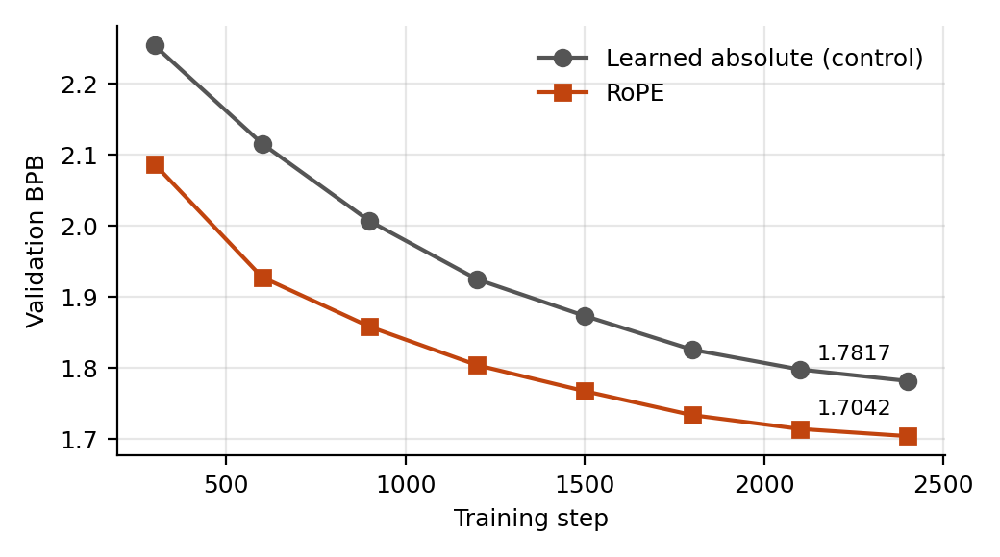
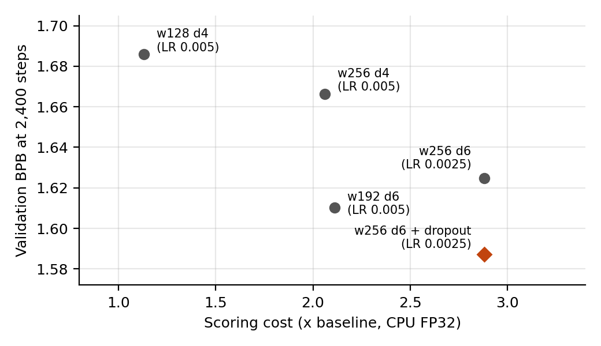
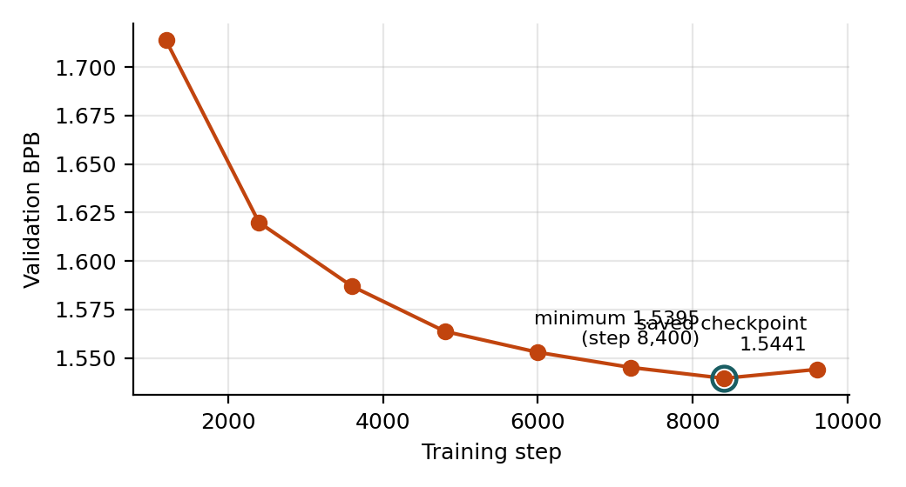

## 1. Introduction

In this mini project, we are required to train a small language model from scratch and compare it with the baseline model provided, which scores 2.1013 BPB on the test split. The model submitted here scores 1.5668 BPB on the test split, a reduction of 25.4% under all three evaluation constraints.

The work proceeded in two stages. The first is to change the training recipe. Correcting the baseline’s 1,200 updates and peak learning rate of 0.001 improves validation BPB from 2.0711 to 1.7817. The second stage is to modify the architecture. The headline mechanism is the replacement of learned absolute position embeddings with RoPE, which improves validation BPB by 0.0775 while removing 32,768 parameters. Further gains came from RMSNorm and dropout.

## 2. Method

I tried 21 training runs in total. The table below shows the main actions. Each row adds to the row above it.

| No | What I changed | BPB | Gain |
|---|---|---|---|
| 0 | The baseline | 2.0711 | — |
| 1 | Changes in the training recipe | 1.7817 | −0.29 |
| 2 | RoPE | 1.7042 | −0.078 |
| 3 | RMSNorm instead of LayerNorm | 1.6859 | −0.018 |
| 4 | Bigger model (5.26M parameters) | 1.6248 | −0.061 |
| 5 | Dropout 0.1 | 1.5872 | −0.038 |
| 6 | Trained 4× longer again | 1.5441 | −0.043 |

(These are validation scores. The final test score was 1.5668.)

### 2.1 Baseline and training recipe

Before changing the model, I checked how the baseline performs. 
**Steps.** The baseline trains for 1,200 steps. So I tried 2,400 and 4,800 and got 1.8807 and 1.7524, respectively. It was still improving when it stopped.

**Learning rate.** Learning rate controls how big a step the model takes each time it corrects itself. The baseline used 0.001. I tried five values:

| Learning rate | 0.001 | 0.002 | 0.003 | 0.005 | 0.008 |
|---|---|---|---|---|---|
| BPB | 1.8807 | 1.8145 | 1.7893 | 1.7817 | 1.8112 |

0.008 is worse than 0.005, which tells me the best value is somewhere in the middle.

### 2.2 Rotary position embeddings (RoPE) (with the great assistance of AI)

Attention lets each word look at earlier words, but by itself it has no sense of order — "dog bites man" and "man bites dog" seem the same. The baseline fixes this by learning 256 separate "position vectors", one for each slot in the window. But nothing tells it that position 40 and position 41 are next to each other. It has to work that out from scratch. And what language actually cares about is relative distance, not position numbers.
Rotary position embeddings, usually called RoPE, rotate each word's vector by an angle based on its position before comparing it with other words. The comparison between two words is a kind of angle measurement, so if I rotate word 10 by ten notches and word 7 by seven notches, what is left is a gap of three notches. Move both to positions 110 and 107 and the gap is still three. Distance is built into the maths instead of being learned. What matters is the relative distance, not the absolute position.

**Ablation.** I put both versions in one file with a switch, so nothing else could differ. With the switch set to the old way, my file gave exactly 1.7816640336740766 — identical to the original baseline to all sixteen digits. That proves my copy was faithful and that the switch is the only difference. With the switch set to the new way, the result turns to be 1.7042. That is a gain of 0.078 (1.7817-1.7042), about 75 times my noise level, and RoPE was ahead at every single checkpoint (Figure 1). It also uses 32,768 fewer numbers, because the learned position table is gone.



The gap is biggest early on — 2.087 against 2.254 after 300 steps — and narrows later. That is what I expected: the old version slowly works out what positions mean, while RoPE is told for free from the start. But it never catches up.

### 2.3 New components (with the great assistance of AI)

I then tried two standard modern components, one at a time.

| Name | BPB | vs RoPE only | Keep or not |
|---|---|---|---|
| RMSNorm | 1.6859 | −0.018 | yes |
| SwiGLU | 1.7050 | +0.001 | no — a tie |

RMSNorm is a simpler way of keeping the numbers inside the model at a steady size. It skips two of the four things the original version does. I expected no difference and got a real improvement. Interestingly, the two runs are identical at step 300 and only separate later, so it is not a head start like RoPE — it makes the later part of training work better.
SwiGLU changes how each block processes information, adding a kind of volume control that the input itself turns. It made no difference here. I kept the original. Testing something and rejecting it is still a result, and it saved complexity.

### 2.4 Bigger model and dropout

How fast a model scores depends only on its shape. So I built six untrained models of different shapes (width and depth), timed them in a few minutes, and only then spent hours training the promising ones.
All six fitted inside the time limit. So I chose on quality instead (steps = 2,400):

| Shape (width × depth) | Parameters | Scoring cost | BPB |
|---|---|---|---|
| 128 × 4 | 1.05M | 1.13× | 1.6859 |
| 256 × 4 | 3.68M | 2.06× | 1.6664 |
| 192 × 6 | 3.06M | 2.11× | 1.6103 |
| 192 × 8 | 3.95M | 2.68× | 1.6258 |
| 256 × 6 | 5.26M | 2.88× | 1.6750 |
| 256 × 6 (LR = 0.0025) | 5.26M | 2.88× | 1.6248 |

The biggest model was the *worst* at first. I suspected its learning rate was too big, halved it to 0.0025, and it improved by 0.050. I could check this was the right explanation: its training score was also bad, not just its validation score. If it had been memorising, the training score would have been good and only validation bad.
With the learning rate fixed, the biggest model did something new: it scored better on the training text than the smaller model (2.82 against 2.93) but worse on validation (1.6248 against 1.6103). That gap is the signature of overfitting. Dropout is the standard fix. During training it randomly switches off 10% of each layer's output, so the model cannot depend on any one detail. It is switched off when scoring.
It worked: 1.6248 → 1.5872, and the big model moved ahead of the smaller one for the first time. I also tried 0.2, which was worse (1.6626), so 0.1 sits at the top of the hill rather than at the edge of what I tried.



### 2.5 The final run

Finally I trained the chosen model four times longer, 9,600 steps.



The score improved all the way to step 8,400 (1.5395) and then got slightly worse at 9,600 (1.5441). That is overfitting arriving again, held off much longer this time by dropout. The trainer only saves the model at the last step, so the model I submitted is the 9,600 one.

Test result is 1.5668 BPB, slightly worse than validation, which is normal — the baseline was 2.0711 on validation and 2.1013 on test, so the same gap appears there. The test text is just a little harder.

## 3. Cost analysis 

| | Baseline | Mine |
|---|---|---|
| CPU Scoring Time | 3.92 s | 11.54 s (2.94×, limit 5×) |
| Peak evaluation RAM | — | 1.83 GiB (limit 4 GiB) |
| Uncompressed Inference Assets | 4.2 MiB | 20.1 MiB (limit 64 MiB) |
| Training Time | 3.5 minutes | 1 hour 52 minutes |

Cost grows more slowly than size: my model has 4.8× the baseline's parameters but takes only 2.94× as long, partly because some of each run is fixed overhead. 

## 4. Critical analysis

**I cannot explain the RMSNorm result.** It is definitely real — 18 times my noise level, with everything else identical. But I do not know why. One idea I could have tested: the trainer shrinks every number in the model slightly on each step ("weight decay"), including the normalization settings, which most modern recipes deliberately leave alone. LayerNorm has more of those settings than RMSNorm. I did not test this.

**The seed is unchanged.** I measured my noise level with two runs of one setup. The big results (0.05–0.08) are far above it and safe. The smaller ones — RMSNorm's 0.018, and the 0.020 between two model shapes — really deserve a second seed.

**The final run is not the best checkpoint.** My best validation score was at step 8,400, but the saved model is from step 9,600, which is 0.0046 worse. If the trainer saved the best model instead of the last one, I would have kept it. That was avoidable.

**My search was narrow and greedy.** I never varied batch size, weight decay, warmup length, or where dropout is applied. Each choice was made assuming the earlier ones were right, so what I have is a good combination, not the best possible one. I also tuned the learning rate and dropout on short runs and assumed the same values would suit a run four times longer — the overfitting at the end suggests slightly more dropout might have been better.

## 5. Reproduction and disclosure

Install as described in the supplied README, then:

```bash
python train.py --implementation student --config configs/rr_w256_d6_do01.json \
  --device cpu --threads 4 --seed 17 --steps 9600 --eval-every 1200 \
  --lr 0.0025 --run-dir runs/final-9600
python evaluate.py --checkpoint runs/final-9600/checkpoint.pt \
  --device cpu --precision fp32 --split test
```

**The final model:** width 256, 6 blocks, 8 heads, RoPE, RMSNorm, dropout 0.1, learning rate 0.0025, 9,600 steps, seed 17. 5,260,032 parameters. Checkpoint fingerprint: `12aacf505d700bb595085a9199b7faba48c393164ae297a96a623bf4b56796db`. The released checkpoint can be scored directly, with no retraining.

**What I changed in the supplied code:** my model is in `student.py`. I added one option to `train.py`, `--lr`, which defaults to the original value so the baseline still behaves exactly as before. I did not touch `common.py`, `evaluate.py` or `data/`, and I kept `model.py` unchanged so I could compare against it.

**Cost of the whole project:** 21 training runs, 6 hours 39 minutes of CPU training. The final run was 1 hour 52 minutes; everything else, 4 hours 47 minutes. No run started from another run's model; all started from scratch. Full details for every run are in `RUN_LOG_TEMPLATE.csv`.

**AI assistance.** I used AI throughout, as a tutor and as a coding assistant. It explained how the baseline works and what the concepts mean; it suggested which changes to try (RoPE, RMSNorm, SwiGLU, dropout, making the model bigger) and how to test them fairly, including the control experiment, the noise measurement and the timing method; it provided code suggestions and explanations, which I then reviewed, modified, and integrated into `student.py` and the `--lr` option; and it helped draft this report from my results. I ran every training run and every measurement myself on my own laptop, and every number here comes from my own logs. I decided which experiments to run, which to skip, and which model to submit. I have read and understood the code I am submitting and the claims in this report.
